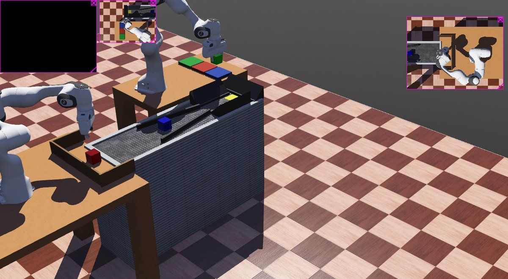
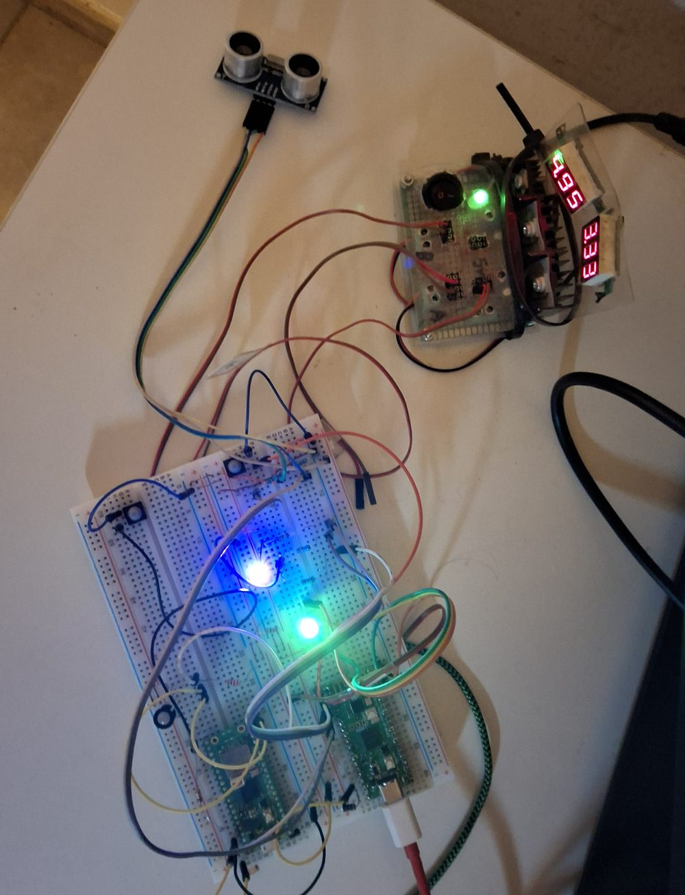

# Virtual Robotic

Un proyecto personal de aficionado, no una empresa de verdad. Esto
empezó por curiosidad — querer entender cómo se mueve un brazo
robótico de verdad — y acabó siendo una celda industrial completa:
dos brazos que cogen y clasifican cubos de colores por una cinta, y
una web que lleva los pedidos como si fuera un taller real.



## ¿Qué es exactamente lo que hay aquí?

Tres piezas, y cada una se puede mirar por separado:

**1. La celda robótica — pero simulada, no física.**
Dos brazos robóticos (un modelo real, el Franka Emika Panda) se
mueven dentro de un simulador llamado **Webots**: un programa que
recrea la física de verdad (gravedad, choques, rozamiento) sin
necesidad de tener el robot delante. Un brazo pone cubos en una
cinta, el otro los recoge y los clasifica por color, comprobando con
"visión artificial" (cámaras simuladas + código que interpreta la
imagen) que de verdad ha cogido lo que cree que ha cogido. Por debajo,
todo esto habla entre sí usando **ROS 2**, que es básicamente el
"sistema nervioso" estándar que usa casi cualquier robot de verdad
para que sus piezas de software se comuniquen.

**2. El panel de pedidos — una web normal y corriente.**
Un sitio web (hecho con FastAPI, un framework de Python, y una base
de datos SQLite) que funciona como el back-office de un taller
pequeño: alguien pide productos, el sistema los va fabricando, y el
almacén se lleva solo. Es la parte más fácil de probar porque no
necesita nada del simulador — es una web como cualquier otra.

**3. Dos Raspberry Pi Pico — hardware real y opcional.**
Una Raspberry Pi Pico es un microcontrolador diminuto (unos 5€,
típico en proyectos de electrónica de aficionado). Aquí hay dos:
una enciende un LED real con el color del producto que se está
fabricando, y la otra hace de botón de parada de emergencia con un
sensor de proximidad. Son un capricho físico, no una pieza necesaria:
**si no las tienes, todo lo demás funciona exactamente igual.**



Construido junto con **[Claude Code](https://claude.com/claude-code)**
(Anthropic): el diseño, la arquitectura y buena parte del código de
este repositorio salieron de sesiones de trabajo con Claude.

## Probarlo (la parte fácil, sin robots)

Solo necesitas [Docker](https://www.docker.com/) instalado — es un
programa que empaqueta todo el software necesario para que no tengas
que instalar nada más a mano. Con eso, dentro de `Taller_Administracion/`:

```bash
docker compose up -d --build
```

Abre **http://localhost:8000** en el navegador: ahí está la web de
presentación, y entrando (usuario `admin`, contraseña `admin`) pasas
al sistema real de pedidos y almacén. Prueba a crear un producto o un
pedido y verás cómo se mueve — todo esto funciona sin tocar el resto
del proyecto.

## Probarlo del todo (con la simulación)

Levantar también Webots + ROS 2 (dos contenedores más, algo más de
peso) y ver los brazos moviéndose de verdad requiere Docker con
soporte de vídeo (sesión gráfica local, no vale por SSH puro).

**La primera vez, mejor sigue los pasos a mano en
[LANZAR_PROYECTO.md](LANZAR_PROYECTO.md) en vez del atajo de abajo.** No
es que esté roto — es que la primera construcción de la imagen de Webots
descarga un paquete grande y **puede parecer colgada mucho rato
alrededor del 70-80%**; yendo paso a paso ves justo dónde tarda cada
cosa, en vez de pensar que algo ha fallado y cortarlo a media
construcción. Una vez que sabes que funciona, ya sí:

```bash
./arrancar_todo.sh
```

Levanta los dos proyectos, compila lo que haga falta, lanza la celda
completa y termina abriendo el panel de control manual — sin necesidad
de las Raspberry Pi Pico físicas. Si Webots se queda colgado cargando el
mundo (le pasa a veces en un arranque en frío), el propio script prueba
solo el arreglo conocido (reiniciarlo) antes de rendirse. Si prefieres
ir paso a paso, o algo falla igualmente (típico en una VM sin
aceleración 3D: revisa el aviso sobre `/dev/dri`), la guía completa está
en **[LANZAR_PROYECTO.md](LANZAR_PROYECTO.md)**.

Para parar todo al terminar: `./cerrar_todo.sh`.

## Más de una línea de producción a la vez

El taller se puede duplicar: levantar una **segunda celda completa**
(su propio Webots, sus propios robots, su propio panel de control)
trabajando en paralelo con la primera, en el mismo ordenador, sin que
se estorben. Las dos comparten el mismo código y el mismo panel de
pedidos.

Lo interesante es cómo se reparten el trabajo sin pisarse: cada línea
tiene un **"Nº Máquina"** que se configura en su panel, y en cuanto una
línea coge un pedido lo marca con su número — a partir de ahí las demás
dejan de verlo como disponible. Así nunca se fabrica dos veces lo
mismo, y de regalo queda registrado qué máquina hizo cada pedido.

La plantilla ya hecha está en `Lab.Panda 2.4/.devcontainer2/`, y los
pasos para usarla (o para montar una tercera, cuarta...) están en
**[anadir_cadena_produccion.md](anadir_cadena_produccion.md)**. No hace
falta para nada si solo quieres probar el proyecto: con una línea
funciona todo igual.

## Qué hay en cada carpeta

- `Lab.Panda 2.4/` — la simulación: Webots, el código ROS 2 de los
  brazos, la cámara/visión artificial y el control del agarre.
- `Taller_Administracion/` — el panel web (pedidos, almacén, usuarios)
  y la propia web de presentación que ves al abrir el puerto 8000.
- `Virtual_Robotic/` — esa misma web de presentación, pero en una
  copia suelta que ni siquiera necesita Docker: la abres con doble
  clic en `index.html` y ya está.
- `Rasberry_Pi_Pico/` y `Rasberry_Pi_Pico_USB_Loader/` — el código de
  las dos Pico. Si vas a usar hardware real, `wifi_config.py` y
  `webrepl_cfg.py` llevan una plantilla: pon ahí tus propias claves.
- `arrancar_todo.sh` y `cerrar_todo.sh` — los atajos de arriba, por si
  prefieres leer antes de ejecutar: no hacen nada que no esté también
  descrito a mano en `LANZAR_PROYECTO.md`.
- `anadir_cadena_produccion.md` — cómo levantar una segunda (o tercera)
  línea de producción en paralelo, explicado paso a paso.

Sin licencia explícita todavía — es un proyecto personal en marcha,
no pensado (de momento) para reutilización de terceros.
